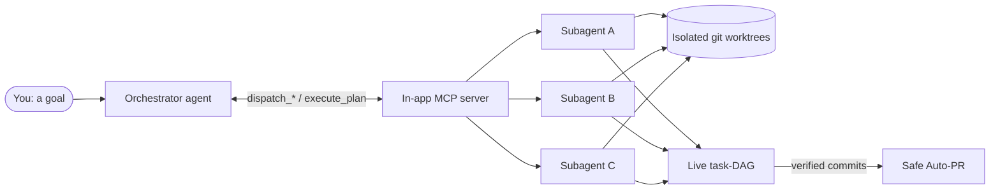

<p align="center">
  
</p>

<h1 align="center">Vertragus</h1>

<p align="center">
  <b>Orchestrate and run multiple AI coding agents in parallel</b><br />
  One cross-platform desktop app for <b>Windows &amp; Linux</b> (macOS buildable from source)
</p>

<p align="center">
  <a href="./LICENSE"></a>
  
  
  <a href="https://github.com/Nehmo101/Vertragus/actions/workflows/ci.yml"></a>
</p>

Vertragus drives the agent CLIs you already have installed — each in its own
live terminal — and lets one configurable **orchestrator** delegate work to
**subagents** across tools. The name is *vertragus*, the ancient Gaulish-Latin
word for a **greyhound** — a hound built for **speed**.

> **Open core.** The entire core is and stays MIT-licensed. Others let you
> start ten agents — Vertragus tells you **which results you can trust**
> (preflight gates, result judge, evidence per task) and **learns** which
> model to send next time. Possible commercial layers (detached/VPS
> persistence, team features) would sit on top later; the core stays free.
> Roadmap: [docs/ROADMAP_OPEN_CORE.md](docs/ROADMAP_OPEN_CORE.md).

Instead of juggling several agent CLIs by hand, you configure a team of agents
once, hand a high-level goal to an orchestrator, and Vertragus coordinates the
delegation, git-worktree isolation, adaptive DAG planning, and (optionally)
opening pull requests.

## Table of contents

- [How it works](#how-it-works)
- [Supported agents & integrations](#supported-agents--integrations)
- [Key features](#key-features)
- [Getting started](#getting-started)
- [Configuration](#configuration)
- [Development](#development)
- [Testing](#testing)
- [Packaging & releases](#packaging--releases)
- [Project status](#project-status)
- [Documentation](#documentation)
- [Contributing](#contributing)
- [License](#license)

## How it works

You give a goal to one **orchestrator** agent. The orchestrator does not edit
code itself — it plans and delegates through an in-app **MCP server** that runs
locally inside Vertragus. Each delegated task becomes a real headless **subagent**
running in its own **git worktree**, so parallel agents never clobber each
other. Progress, dependencies and results stream into a live **task-DAG** panel,
and finished work can flow into a **safe Auto-PR**.



The orchestrator follows a **plan → execute → check → re-plan** loop until the
goal is verifiably met or a concrete dead end needs a human decision. An
adaptive planner picks the smallest useful team and validates every plan (task
IDs, roles, dependencies, cycles, parallelism and file-conflict keys) *before*
any process starts.

## Supported agents & integrations

| Provider | Command | Role |
|---|---|---|
| **Claude Code** | `claude` | agent / orchestrator (CLI aliases and account options) |
| **Kimi K3** | `kimi` | agent / subagent / orchestrator (Moonshot Kimi Code CLI, MCP-native) |
| **Codex** | `codex` | agent / orchestrator (CLI-configured model) |
| **Cursor Agent** | `cursor-agent` | agent (account-exposed CLI models) |
| **GitHub Copilot** | `copilot` | agent / subagent / orchestrator (`@github/copilot` CLI) |
| **Ollama** | `ollama` | local LLMs (HTTP API on `:11434`) |
| **GitHub** | `gh` | repo / branch / PR context |
| **Cloudflare Tunnel** | `cloudflared` | remote access (planned) |

> [!NOTE]
> The CLIs authenticate through their own subscriptions. Vertragus invokes
> the already-authenticated tools and does **not** manage, transmit or store
> their API keys, passwords or tokens.

## Key features

**Workspace & terminals**

- **Multi-agent workspace** — a tiled grid of live PTY terminals (one per
  agent); pop any pane out into its own OS window (hybrid grid + pop-out).
- **Cozy Organic UI** — one warm visual system with persisted light/dark mode
  and tiles / focus / DAG layout controls; honours reduced-motion and keyboard
  focus.
- **Session-safe worktree isolation** — each agent works in
  `<repo>/.orca-worktrees/<agent-id>` on branch `orca/<agent-id>` (internal
  identifiers, migration planned); old worktrees are never silently reused or
  deleted.

**Orchestration**

- **Configurable orchestration** — pick who orchestrates whom (e.g. a Claude
  orchestrator driving three account-enabled coding agents). Delegation happens
  through the in-app **MCP server** (`set_goal`, `dispatch_subagent`,
  `dispatch_batch`, `execute_plan`, `list_subagents`, `open_subwindow`, …);
  dispatched subtasks run as real subagents and stream into a live **task-DAG**.
- **Adaptive planner** — starts orchestrated profiles with only the coordinator,
  selects the smallest useful team from role strengths/weaknesses, validates
  DAGs before execution, and can add or replace workers during focused recovery
  and follow-up plan loops. Modes: `auto`, `review` (approve first) and `manual`.
- **Reliable async lifecycle** — dispatch returns task IDs immediately; polling
  exposes heartbeats and results, while verified commits, shared-file ownership,
  security gates and a dedicated integration phase protect each implementation
  wave. See [Reliable Agent Lifecycle](docs/RELIABLE_AGENT_LIFECYCLE.md).

**Integrations & safety**

- **Safe Auto-PR** — runs configured quality gates, scans staged diffs
  (`git diff --check`, size limits, secret patterns), prepares task commits and
  publishes an aggregate or per-task PR **without force-push, auto-merge, or any
  push to `main`/`master`**, then tracks GitHub checks as a separate remote-CI
  state.
- **External MCP servers** — connect your own Model-Context-Protocol servers
  (filesystem, web search, database, …) once in Vertragus; they attach to every
  launched agent — the orchestrator **and** each subagent — over `stdio`, `http`
  or `sse`, with a per-server scope (all / orchestrator / subagents) and an
  enable switch. Wired for the Claude, Kimi, Codex and GitHub Copilot CLIs.
- **Provider connections** — shows real account state and opens each provider's
  official CLI login in a visible terminal; Vertragus never receives or stores
  credentials.
- **Yolo Mode** — per-agent and global auto-approve so agents work without
  prompts (`--dangerously-skip-permissions` /
  `--dangerously-bypass-approvals-and-sandbox` / `--yolo`), guarded by a red
  warning badge, a global kill-switch and git-worktree isolation.

**Operations**

- **Production hardening** — sandboxed Electron windows, CSP and navigation
  allowlists, redacted per-run diagnostics, a read-only task review cockpit,
  selected-agent push-to-talk with explicit preview, and Windows/Linux UI smoke
  tests.
- **Main-channel self-update** — every successful `main` build is published for
  Windows and Linux; the title bar offers download and restart only when a newer
  build exists.
- **Real usage values** — persisted task state plus token / cost / step counts
  when the provider reports them (otherwise the UI clearly shows "not available").

## Getting started

### Prerequisites

- **Git**
- **Node.js 22.13+** with **Corepack** enabled (`corepack enable`) — the package
  manager is pinned to **pnpm 11.6.0** and provisioned via Corepack.
- **At least one agent CLI**, installed and already authenticated — `claude`,
  `codex`, `cursor-agent` or `copilot` (`@github/copilot`).
- **Optional:** [Ollama](https://ollama.com) for local models (HTTP on `:11434`),
  and the GitHub CLI (`gh`) for repo/PR context and Auto-PR.

Vertragus does not ask for API keys — every provider signs in through its own
CLI and subscription.

### Run from source

```bash
git clone https://github.com/Nehmo101/Vertragus.git
cd Vertragus
corepack pnpm install --frozen-lockfile   # flat node_modules via .npmrc
corepack pnpm dev                          # launch the app with HMR
```

### Or install a packaged build

Download the latest build from
[GitHub Releases](https://github.com/Nehmo101/Vertragus/releases) — a Windows
NSIS installer (`.exe`) or a Linux `AppImage` / `.deb`. Installed builds follow
the `main` update channel and offer an in-app update when a newer build exists.

### First run

1. Open the app and check which providers are available in the left **sidebar**
   (installation vs. account connection are shown separately). Sign in to any
   provider whose CLI login you still need.
2. Create a **Workspace profile** in the profile editor.
3. Set the **Working Directory** (your repository), optionally binding a GitHub
   repo/project.
4. Choose an **orchestrator** and your **subagent slots** (role, provider, model,
   count), and pick a planner **mode** (`auto` / `review` / `manual`).
5. **Save**, then **Start all**.
6. Give the orchestrator a clear goal (e.g. *"reproduce and fix the broken
   checkout flow with a minimal change, add unit + E2E tests, run
   typecheck/tests/build, and summarise the changes and risks"*). It will call
   `set_goal`, inspect the team with `list_subagents`, and dispatch work.

A full walkthrough lives in the German
[handbook](docs/VERTRAGUS_HANDBUCH.md).

## Configuration

Configuration is UI-driven and persisted with `electron-store` (versioned,
migrated, and backed up before upgrades). The primary object is the **workspace
profile**:

- **Working directory / GitHub binding** — repo root, branch, remote and
  dirty-state are surfaced; a running team is pinned to a profile snapshot and a
  UUID session.
- **Planner** — `mode` (`auto` / `review` / `manual`), routing (`fixed` /
  `adaptive`), `maxParallel`, `maxRetries`.
- **Yolo** — per-slot and global auto-approve with a global kill-switch.
- **Auto-PR** — off / draft-after-checks / ready-after-checks; one aggregate PR
  or one PR per task; configurable quality gates (default
  `corepack pnpm typecheck|test|lint`), base branch, labels and reviewers.
- **External MCP servers** — name, transport (`stdio` / `http` / `sse`), scope
  (all / orchestrator / subagents) and an enable switch.
- **Provider limits** — per-provider concurrency "gates" (default 8, range
  1–99).

## Development

```bash
corepack pnpm install --frozen-lockfile   # flat node_modules via .npmrc
corepack pnpm dev                          # launch the app with HMR
corepack pnpm run ci                       # canonical: icons + lint + typecheck + test + build
corepack pnpm run test:ui-smoke            # verify critical Electron UI surfaces
```

`corepack pnpm run ci` is the canonical gate every change must pass.

**Repository layout** (`src/`):

| Path | Responsibility |
|---|---|
| `src/main` | Electron main process — agents, orchestrator engine, MCP server, providers, IPC, security, voice, diagnostics |
| `src/preload` | context-bridge API exposed to the renderer |
| `src/renderer` | React UI (workspace grid, orchestrator panel, editors) |
| `src/shared` | types & logic shared across processes (agents, MCP, orchestrator, profiles, providers, telemetry, retro) |

Tests are co-located next to their sources as `*.test.ts`. Setting
`VERTRAGUS_MCP_SELFTEST=1` runs an end-to-end self-test of the MCP tools and engine,
then exits (useful for CI and local sanity checks).

## Testing

```bash
corepack pnpm test              # Vitest unit tests (node environment)
corepack pnpm run test:ui-smoke # launch Electron and verify critical UI surfaces render
```

The MCP integration self-test exercises the adapter capabilities, tool list,
single dispatch, batch parallelism, validated DAG execution, dependencies and
the safe fallback for cyclic plans:

```bash
VERTRAGUS_MCP_SELFTEST=1 corepack pnpm start
```

## Packaging & releases

```bash
pnpm build:win     # Windows NSIS installer (.exe)
pnpm build:linux   # Linux AppImage + .deb
pnpm build:mac     # macOS universal dmg/zip — buildable from source
```

Windows and Linux are the **officially released** targets and drive the `main`
self-update channel: a successful push to `main` publishes a newer Windows/Linux
build automatically, and tagged releases remain available for fixed milestones.
macOS builds from source via `pnpm build:mac` but is **not** part of the
auto-update channel.

## Project status

- Multi-agent terminals, profiles, worktrees and pop-outs: **complete**.
- Claude, Kimi, Codex and GitHub Copilot orchestration with MCP: **complete**.
- Adaptive DAG planning, review mode, session binding and Auto-PR: **complete**.
- Read-only task review, redacted diagnostics and selected-agent STT: **available**.
- Electron hardening, config migrations and UI smoke: **available**.
- Cursor and Ollama remain **workers only** (starting them as a fake orchestrator
  without delegation tools is blocked in both UI and runtime).

**Deliberately out of the current sprint:** the merge/conflict editor (the review
cockpit stays read-only), authenticated Cloudflare remote control, offline
Whisper STT, signed production installers, and GitHub Artifact Attestations
(currently disabled).

See [implementation status](docs/IMPLEMENTATION_STATUS.md) and
[production hardening](docs/PRODUCTION_HARDENING.md) for exact boundaries.

## Documentation

Additional docs live in [`docs/`](docs/). Most are written in **German**:

- [Implementation status](docs/IMPLEMENTATION_STATUS.md) — verified feature boundaries.
- [Reliable Agent Lifecycle](docs/RELIABLE_AGENT_LIFECYCLE.md) — async dispatch, gates and integration phase.
- [Production hardening](docs/PRODUCTION_HARDENING.md) — sandboxing, CSP, diagnostics.
- [Handbook](docs/VERTRAGUS_HANDBUCH.md) — usage, development and operations (DE).
- [Git workflow](docs/GIT_WORKFLOW.md) — branches, worktrees and pull requests.
- [Roadmap](docs/VERTRAGUS_ROADMAP.md) — product & technical roadmap (DE).
- [Orchestrator training prompts](docs/ORCHESTRATOR_TRAINING_PROMPTS.md) — training & evaluation catalog.
- [Voice interface plan](docs/VOICE_INTERFACE_PLAN.md) — speech-to-text design.
- [Changelog](CHANGELOG.md) — detailed release history back to the first commit (DE).

## Contributing

Every change reaches **`main`** only through a pull request with green CI
(never commit directly to `main`). Run `corepack pnpm run ci` before opening a
PR. See [CONTRIBUTING.md](CONTRIBUTING.md) for the full branching model and
conventions.

## License

[MIT](./LICENSE) © 2026 Nehmo101
