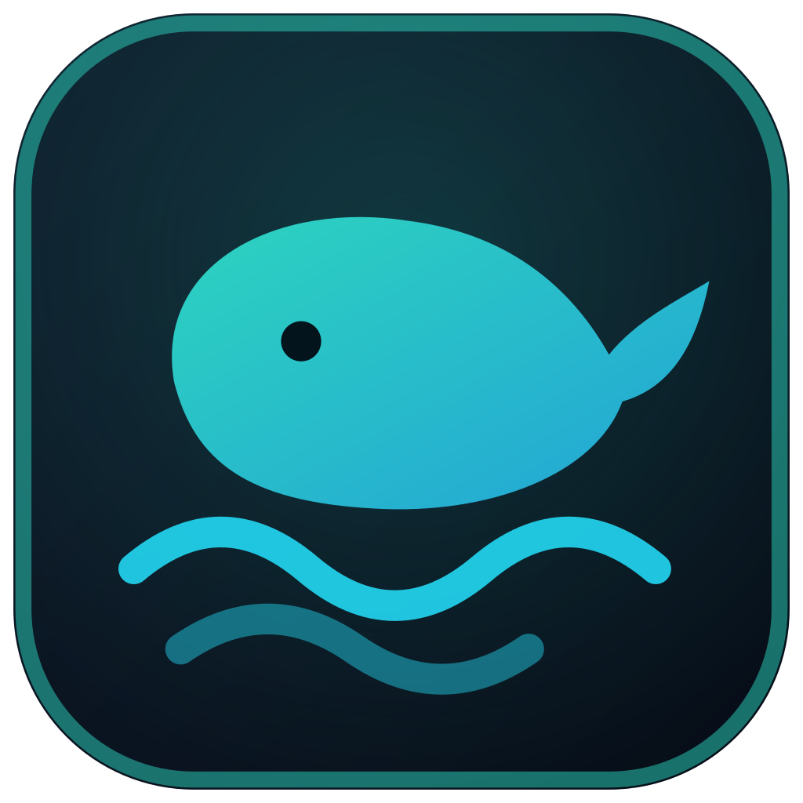

<p align="center">
  
</p>

<h1 align="center">Orca-Strator</h1>

<p align="center">
  <b>Orchestrate and run multiple AI coding agents in parallel</b><br />
  One cross-platform desktop app · <b>Windows + Linux</b>
</p>

Orca-Strator drives the agent CLIs you already have installed — each in its own
live terminal — and lets one configurable **orchestrator** delegate work to
**subagents** across tools.

The current `DEV` implementation adds verified **Claude, Codex and GitHub Copilot
orchestrators**, a validated adaptive DAG planner, workspace/session binding,
safe Auto-PR policies, production hardening, and the **Cozy Organic** UI. See the
[implementation status](docs/IMPLEMENTATION_STATUS.md) for exact boundaries.

## Supported agents & integrations

| Provider | Command | Role |
|---|---|---|
| **Claude Code** | `claude` | agent / orchestrator (e.g. model *Fable*) |
| **Codex** | `codex` | agent / orchestrator (CLI-configured model) |
| **Cursor Agent** | `cursor-agent` | agent (e.g. GPT‑5.6 / Sonnet) |
| **GitHub Copilot** | `copilot` | agent / subagent / orchestrator (`@github/copilot` CLI) |
| **Ollama** | `ollama` | local LLMs (HTTP API on `:11434`) |
| **GitHub** | `gh` | repo / branch / PR context |
| **Cloudflare Tunnel** | `cloudflared` | remote access (later) |

> The CLIs authenticate through their own subscriptions. Orca-Strator invokes
> the already‑authenticated tools and does **not** manage their API keys.

## Key features

- **Multi-agent workspace** — a tiled grid of live terminals; pop any pane out
  into its own OS window (hybrid grid + pop-out).
- **Configurable orchestration** — pick who orchestrates whom, e.g. a
  Claude/*Fable* orchestrator driving **3× GPT‑5.6** subagents. The orchestrator
  delegates through an in-app **MCP server** (`dispatch_subagent`,
  `dispatch_batch`, `execute_plan`, `list_subagents`, `open_subwindow`,
  `set_goal`); dispatched subtasks run as real subagents and stream into a live
  **task-DAG** panel.
- **Adaptive planner** — validates DAGs, dependencies, conflict keys and
  concurrency before execution; supports auto, review-first and manual modes.
- **Safe Auto-PR** — runs configured gates, scans staged diffs, prepares task
  commits and publishes aggregate or per-task PRs without force-push or merge.
- **Cozy Organic workspace UI** — one warm visual system with persisted light/dark
  mode plus tiles/focus/DAG layout controls.
- **Yolo Mode** — per-agent and global auto-approve so agents work without
  prompts (`--dangerously-skip-permissions` / `--dangerously-bypass-approvals-and-sandbox`
  / `--yolo`), with a red warning badge, a global kill-switch, and git-worktree
  isolation.
- **External MCP servers** — connect your own Model-Context-Protocol servers
  (filesystem, web search, database, …) once in Orca; they are attached to every
  launched agent — the orchestrator **and** each individual subagent — so all of
  them can see and use those tools directly. stdio, HTTP and SSE transports, a
  per-server scope (all / orchestrator / subagents) and an enable switch; wired
  for the Claude, Codex and GitHub Copilot CLIs.
- **Provider connections** — shows real account state and opens the official
  Claude, Codex, Cursor, Ollama, GitHub or Cloudflare CLI login in a visible
  terminal; Orca never receives or stores passwords, API keys or tokens.
- **Main-channel self-update** — every successful `main` build is published for
  Windows and Linux; the title bar offers download and restart only when a newer
  main build exists.
- **Session-safe worktree isolation**, provider health, persisted task state and
  real token/cost/step values when the provider reports them.

- **Production hardening** — sandboxed Electron windows, CSP and navigation
  allowlists, redacted per-run diagnostics, a task review cockpit, selected-agent
  push-to-talk with explicit preview, and Windows/Linux UI smoke tests.
- **Supply-chain provenance** — release artifacts can be certificate-signed and
  published with GitHub Artifact Attestations.

## Tech stack

Electron · TypeScript · React · Vite (`electron-vite`) · node-pty + xterm.js
(terminals) · `@modelcontextprotocol/sdk` (orchestrator ↔ subagent dispatch) ·
electron-store + zod (config) · electron-builder + electron-updater (main-channel
updates and packaging: NSIS `.exe` + AppImage/`.deb`).

## Development

```bash
pnpm install     # flat node_modules via .npmrc (node-linker=hoisted)
pnpm dev         # launch the app with HMR
pnpm typecheck   # type-check main + preload + renderer
pnpm build       # typecheck + production build
pnpm test:ui-smoke # start the built Electron app and verify critical UI surfaces
```

### Packaging

```bash
pnpm build:win     # Windows NSIS installer
pnpm build:linux   # Linux AppImage + .deb
```

Installer from GitHub Releases follow the `main` update channel. A successful push
to `main` publishes a newer Windows/Linux build automatically; tagged releases
remain available for fixed release milestones.

## Current delivery status


- Multi-agent terminals, profiles, worktrees and pop-outs: complete.
- Claude, Codex and GitHub Copilot orchestration with MCP: complete.
- Adaptive DAG planning, review mode, session binding and Auto-PR: complete.
- Read-only task review, redacted diagnostics and selected-agent STT: available.
- Electron hardening, config migrations, UI smoke and artifact provenance: available.
- Full conflict editor, offline Whisper, signed production certificates and
  authenticated Cloudflare remote control: still open.

See [implementation status](docs/IMPLEMENTATION_STATUS.md) and
[production hardening](docs/PRODUCTION_HARDENING.md) for exact boundaries.

### Historical phase snapshot (superseded)
- **Phase 0** — repo & scaffold, config store, provider health ✔
- **Phase 0.5** — UI layout/mockup (design handoff) ✔
- **Phase 1** — multi-agent grid with live PTY terminals, pop-out windows,
  Yolo mode + kill switch, worktree isolation, profile editor ✔
- **Phase 2** — orchestrator engine + in-app MCP dispatch, live task-DAG panel,
  headless subagent runs *(current — diff/merge view & cost/token tracking still
  open)*
- **Phase 3** — Cloudflare Tunnel, session persistence, installers

## License

[MIT](./LICENSE) © 2026 Nehmo101
