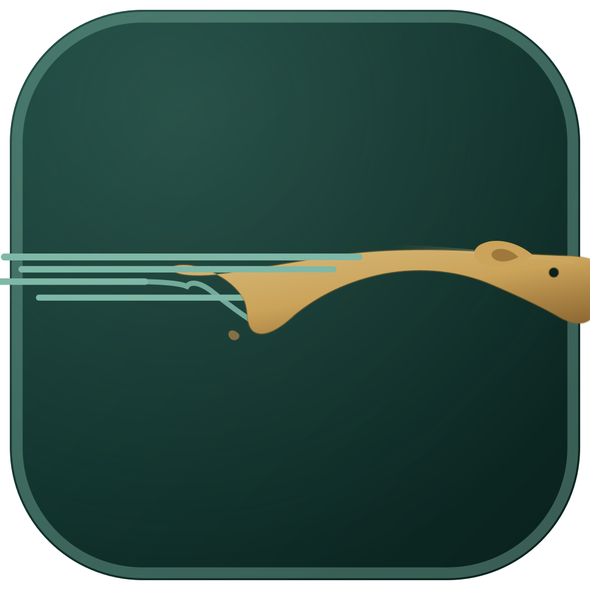

<p align="center">
  
</p>

<h1 align="center">Vertragus</h1>

<p align="center">
  <b>Orchestrate AI coding agents in parallel</b><br />
  A translucent panel that runs your agent CLIs as a coordinated team
</p>

Vertragus is a small always-on-top glass panel. You define **profiles** — a
repo path, an orchestrator CLI (Claude, Codex, Kimi, Cursor, Grok Build, …) and a set of
subagent roles — and press play. The orchestrator opens in its own translucent
terminal window, and starts **visible** subagent windows on demand. Agents and
orchestrator talk over a slim in-app MCP server with true blocking
communication: no polling, no starving workers.

The name is *vertragus*, the ancient Gaulish-Latin word for a greyhound.
Agents are named after the Divine Comedy — orchestrators get guides
(Virgilio, Beatrice, …), subagents get the cast (Caronte, Ulisse, …),
workspaces get places (Paradiso, Inferno, …).

> **Status: early rework.** This repository is a ground-up restart of
> [Vertragus-Archiv](https://github.com/Nehmo101/Vertragus-Archiv) with a
> radically smaller core. Nothing here is release-ready yet.

The German handbook [`docs/HANDBUCH-HARNESS.md`](docs/HANDBUCH-HARNESS.md)
is the code-grounded map of the harness core; serial root succession
(fresh context, same team) is described in
[`docs/ORCHESTRATOR-SUCCESSION.md`](docs/ORCHESTRATOR-SUCCESSION.md) and
implemented in its first stage.

## How a run works

A **profile** is a blueprint, not a pre-started team: a repository path, one
orchestrator (provider, model, effort), and **slots** ("a reviewer runs on
codex, at most two of them"). Pressing **Play** starts a workspace with only
the orchestrator; it decides which agents it actually needs, bounded by the
slot caps and the profile-wide `maxSubagents`. The Play button folds out a
**goal field** — the goal is typed into the orchestrator over the same
keyboard handshake as any assignment, so what the card shows is what the
orchestrator really received. **Playbooks** are one-click goal templates on
that fold-out, never a pre-configured crew.

Everything the orchestrator can do goes through its MCP tools — there is no
second path:

| Tool | What it does |
| --- | --- |
| `start_agent{role, task, model?, providerId?, slotId?, baseBranch?, resultSchema?, taskId?}` | Start a subagent in its own worktree. Explicit provider/slot choice fails hard instead of silently falling back; `baseBranch` chains onto another agent's result; `resultSchema` makes the agent's final report a validated JSON object; `taskId` claims a board task and seeds its subject into the assignment. |
| `send_to_agent{agentId, text, questionId?}` | Answer an agent's question or give a follow-up instruction. |
| `await_events{cursor, timeoutSec?}` | The main loop: block until something happens. True long-poll, no busy polling. |
| `list_agents` / `read_output` / `inspect_agent` | Snapshot, raw terminal tail, and **read-only git facts** (status/diff/log/file) from an agent's worktree — verification is host truth, not the agent's word. Oversized output spills to a file (preview + path) instead of being truncated. |
| `stop_agent` | End an agent; files, branch and worktree stay. |
| `integrate_branch{agentId, branch}` | The one sanctioned merge path: a **host-side** merge into the target agent's worktree. Conflicts abort cleanly and are reported (`integrate_conflict`); a gate warning flags integrating unverified work. |
| `ask_user{question, ticket?}` | Ask the human and block for the answer (panel badge and phone); ticket-resume survives the MCP request timeout. |
| `start_orchestrator{area, task, …}` | Start a **lead** (see below). |
| `record_retro{summary, learnings, repoNotes?}` | The run retrospective, once at the end. |
| `request_succession{reason, …}` | Replace a context-full root with a successor that keeps the same team, queue and open questions. |
| `task_create` / `task_update` / `task_list` | The shared **task board**: host state with CAS revisions, `blockedBy` dependencies and ownership. It survives succession and resume — the plan lives on the host, not in the model context. |
| `search_runs{query, maxResults?}` | Full-text search over this repository's past run journals — the root's institutional memory. |

Subagents report back with `report_done` / `ask_orchestrator` /
`report_progress`. Every task carries a **contract** appended by the MCP
layer, so no spawn path can produce an agent that never reports. CLIs without
MCP support (e.g. Ollama) speak a **sentinel dialect** instead — echo-safe
marker lines parsed from the PTY, same events, same question registry.

Lifecycle, questions, progress, integration and budget all arrive as typed
**events** (eighteen kinds) on a per-workspace queue with cursors; the ring
keeps the last 1000 and the on-disk journal keeps everything.

## Git isolation — and how work comes back

- **Every agent gets its own worktree and `vertragus/*` branch** — parallel
  agents (and parallel workspaces on the same repo) never trample each other.
  Nothing is auto-deleted; the panel's broom lists stale worktrees for
  explicit cleanup.
- **Workers never commit.** When an agent reports done, the host snapshots
  its dirty worktree into a commit on the agent's branch (pinned committer
  identity, `--no-verify`, no push) and attaches host facts — branch, HEAD,
  changed files, diffstat — to the `agent_done` event.
- **Handoffs are packages, not prose.** `start_agent{baseBranch}` inserts the
  predecessor's own report, status and file list between task and contract,
  with the standing instruction to verify against the checkout.
- **Promote is a human click.** Merging the final result into the
  repository's own branch happens from the panel (and refuses a dirty main
  checkout); the orchestrator never runs git itself, and the remote
  allow-list deliberately has no promote verb.

## The human stays in the loop

- **Steering:** a composer on every workspace card (panel and phone) sends a
  `user_message` that wakes the orchestrator's `await_events` immediately.
  The text shows in its terminal display-only — delivery is the event, so
  there is no second brain typing into the TUI.
- **Questions in both directions:** an agent's open question shows as a `?`
  badge answerable from panel or phone (one host path, one question
  registry); the orchestrator's `ask_user` shows on the workspace card the
  same way.
- **Idle watchdog:** an orchestrator process that is alive but has stopped
  calling tools for two minutes gets flagged (`orchestrator_idle`) on the
  card and the remote client — distinct from process death, and long-polls
  don't false-positive.
- **Subagent policy tiers** (`yolo` / `ask-user` / `ask-orchestrator`)
  govern how far agents act on their own — see the threat model below.

## Scale and endurance

- **Leads (depth 1, opt-in):** the root can start sub-orchestrators that own
  one area each with their own team and event queue. Fan-in is the point: a
  subtree's events never flood the root, grandchildren are invisible to it,
  leads never talk to each other, and a dying lead's agents are reparented to
  the root (`subtree_adopted`). The host never auto-nests.
- **Succession:** when the root's context fills, `request_succession` hands
  the same workspace — team, queue, open questions — to a fresh-context
  successor; the old orchestrator token is rotated so the predecessor is
  locked out at cutover.
- **Runtime budget:** `maxRuntimeMin` is a wall clock over agent-seconds
  (never a guessed token counter): a warning at 80 %, no new starts once
  spent.
- **Journal & resume:** every event of a run is appended to
  `.vertragus/runs/<id>/events.jsonl` (plus a `meta.json` with goal and
  identity) in the repository. "Resume last run" on the Play fold-out starts
  a **new** orchestrator briefed on the previous run — its agents, branches
  and reports. Honestly scoped: worktrees and branches survive and can be
  chained via `baseBranch`; processes and open tickets do not, and the
  briefing says so.
- **Memory:** each run ends in a retrospective — per-model strengths and
  weaknesses steer future model choice, durable **repo notes** feed the next
  orchestrator's briefing (alongside the project doc and recent `git log`),
  and both are inspectable and deletable in the panel's retro view. No RAG,
  no index.

## Providers

Provider presets ship for **Claude Code, Codex, Kimi, Cursor Agent, Grok
Build and Ollama**; custom providers are data, not code — command, args,
model/effort flags, yolo flags, MCP attach dialect, system-prompt delivery.
The in-app MCP server is loopback-only with per-identity tokens
(orchestrator / lead / subagent), and each CLI is attached through its own
verified dialect: a strict transient config file (Claude), process-local
`-c` overrides (Codex), or a merged project file in the agent's worktree
(Kimi, Cursor, Grok — token-carrying files are kept out of the user's git
history). Orchestrators and leads run on a strict tool allow-list; workers
run unrestricted — their discipline is the contract, not a tool cage.

A slot can declare **extra MCP servers** (`extraMcp: [{name, url}]`, e.g. a
browser tool) that its agents attach in addition to Vertragus — subagents
only, never the orchestrator or a lead, and the name `vertragus` is reserved
so nothing can shadow the reporting channel.

## Desktop niceties

Translucent, theme-aware windows with adjustable glass; per-role window
colours that match the panel's status dots; per-profile **zones** that pin
role windows to screen regions; a global hide-all hotkey; autostart and a
self-updater with a stable/main channel switch; German and English UI.

## Remote access (Tailscale)

Vertragus can be driven from your phone or another browser while it runs on
your PC. It is **off by default**; enable it under **Settings → Remote access**.

- **Transport is your tailnet.** The remote server binds, by default, to the
  machine's auto-detected [Tailscale](https://tailscale.com) address
  (`100.64.0.0/10`). Traffic is WireGuard-encrypted by Tailscale end to end, so
  Vertragus adds no TLS and opens no port to the public internet. `0.0.0.0`
  (all interfaces, including your LAN) is available behind an explicit typed
  confirmation — use it only when you understand the exposure.
- **Pairing.** Enabling generates a 256-bit pairing token, shown as a QR code
  and a link. Scanning it on a device on the same tailnet exchanges the token
  for a session; the token is stored encrypted at rest (Electron `safeStorage`)
  and, so the QR survives a restart even without a keyring, in a 0600 file
  under userData. Regenerating it is the only way the link changes — it
  disconnects every paired device. The phone also keeps the pairing token in
  `localStorage` and silently mints a new session if the desktop restarted.
- **What a remote device can do.** Watch any agent's terminal live, type into
  it, start a workspace **with a goal** (the host seeds it into the
  orchestrator over the same handshake as any assignment; starting without a
  goal stays allowed and the card says "no goal — the orchestrator is
  waiting"), stop workspaces, send the orchestrator a steering message, and
  **answer an agent's open MCP question** from its `?` badge. The command
  allow-list is exactly six verbs: `workspaces:list`, `workspaces:start`,
  `workspaces:stop`, `profiles:list`, `answer_question`, `user_message`.
  There is no `focus_agent` or `stop_agent` on the gateway.
  `answer_question` takes the same host path as the orchestrator's
  `send_to_agent{questionId}`, so it resolves the parked `ask_orchestrator`
  wait (and delivers sentinel answers into the agent's PTY) — one question
  registry, one truth. Typing into a raw PTY still only reaches the CLI
  (permission dialogs live there). A remote device **cannot** edit profiles,
  providers or settings, touch windows or zones, remove worktrees, or promote
  branches.
- **Threat model — read this.** By default subagents run in YOLO mode
  (`--dangerously-skip-permissions`). **A paired device therefore has code
  execution on your PC through the agents it drives.** Only pair devices you
  would trust with the machine itself. The settings section lists connected
  devices and lets you disconnect any of them; disabling remote access or
  regenerating the token severs every session immediately. The in-app MCP
  server that agents use stays loopback-only and is a separate listener with a
  separate token domain — remote access never widens it.

  The **subagent policy** (settings window) has three tiers — be honest with
  yourself about what each one actually guarantees:

  | Tier | CLI permission flags | Enforcement | Trade-off |
  | --- | --- | --- | --- |
  | `yolo` (default) | skip-permissions on | none | Full autonomy. An agent can run any command your user account can. |
  | `ask-user` | off | **hard** — the CLI's own permission prompt blocks in the agent's terminal | Safest, but needs you at the desktop; unattended runs stall. Remote v1 deliberately does not relay these CLI prompts to a phone. |
  | `ask-orchestrator` | skip-permissions on | **soft** — the task contract requires `ask_orchestrator` approval before risky actions | Keeps runs unattended, and the orchestrator can escalate to you via `ask_user`. But it is prompt-level only: a misbehaving or manipulated agent can ignore the rule. Treat it as guidance for honest agents, not as a sandbox. |

  Orchestrators and leads never get yolo flags under any tier — they operate
  through an MCP tool allow-list instead. The panel footer's yolo switch is the
  coarse control: on = `yolo`, off = `ask-user`; the three-way picker lives in
  the settings window, and both write the same stored truth.

## Development

```bash
corepack pnpm install --frozen-lockfile
corepack pnpm dev        # launch with HMR
corepack pnpm run ci     # lint + typecheck + test + build — the canonical gate
```

`VERTRAGUS_DEV_RUN=<repo> pnpm dev` starts a headless dev workspace on a real
repository without touching the UI. The test suite (1500+ tests) includes
integration tests that drive the full MCP loop over a real HTTP server and
the orchestration chain over a real git repository — worker fix, snapshot
commit, `inspect_agent`, tester on the worker's branch, clean orchestrator
worktree.

Windows is the primary, owner-verified platform; macOS and Linux are built in
CI on a best-effort basis.

## License

[MIT](./LICENSE) © 2026 Nehmo101
