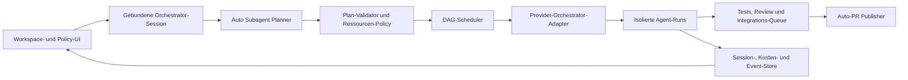

# Vertragus – Produkt- und Technik-Roadmap

Stand: 12. Juli 2026
Audit-Basis: `main` bei Commit `d396a0a`

## Mission-Control-Lieferstatus (15. Juli 2026)

Die später ergänzte Mission-Control-Roadmap ist bis Phase D umgesetzt. Damit
sind die zusätzlichen Features **Diff-/Merge-Center**, **Kosten-/Token-Budgets**,
**providerübergreifende Approval-Inbox** und **Provider-Fallback bei Limits**
über Desktop und den authentifizierten Remote-Kanal nutzbar. Sicherheits- und
Providergrenzen sind in `docs/MISSION_CONTROL_PROVIDER_COVERAGE.md`, die
Phase-D-Flächen in `docs/MISSION_CONTROL_PHASE_D.md` dokumentiert.

Diese Statusnotiz aktualisiert den Lieferstand; die nachfolgende Audit-Historie
vom 12. Juli bleibt als ursprüngliche Planungsbasis erhalten.

## Kurzfazit

Vertragus ist kein Mock-up mehr. Die Anwendung besitzt einen funktionierenden
Electron-Unterbau, echte PTY-Terminals, Profile, einen nativen Workspace-Picker,
Git-Worktrees, einen lokalen MCP-Server und paralleles Subagent-Dispatching mit
Kapazitätsgrenzen.

Vor weiterer Automatisierung braucht sie jedoch eine Stabilitätsphase. Nur Claude
erhält heute die Orchestrator-Werkzeuge, obwohl die UI weitere Provider zulässt.
Tests und PR-CI fehlen, `pnpm lint` ist nicht ausführbar, alte Worktrees können
nach App-Neustarts wiederverwendet werden und ein Profilwechsel kann einen
laufenden Orchestrator auf einen anderen Workspace umleiten.

Die Zielrichtung:

1. Laufzeit und Git-Isolation zuverlässig machen.
2. Orchestrierung providerneutral aufbauen.
3. Einen echten Auto-Subagent-Planner mit DAG-Scheduler einführen.
4. Ergebnisse sicher integrieren und automatisch als Draft-PR veröffentlichen.
5. Darstellung über Design-, Dichte- und Layout-Presets umschaltbar machen.

## Was heute vorhanden ist

| Bereich | Status | Beobachtung |
|---|---:|---|
| Electron-App Windows/Linux | vorhanden | Build und Installer-Konfiguration sind vorhanden. |
| Profile und Workspace-Auswahl | vorhanden | Freitext plus nativer Ordnerdialog. |
| Interaktive Agents | vorhanden | PTYs, xterm.js, Scrollback, Resize und Pop-outs. |
| Team-/Parallelstart | vorhanden | Orchestrator und konfigurierte Slots starten als Team; MCP kann weitere Task-Runs erzeugen. |
| Claude als Orchestrator | vorhanden | Claude erhält MCP-Konfiguration, System-Prompt und Vertragus-Tools. |
| Codex/Cursor/Ollama als Orchestrator | nur UI | Auswahl möglich, Tools werden nicht angebunden. |
| Paralleles Dispatching | vorhanden | `dispatch_batch` plus Semaphoren je Rolle. |
| Auto-Subagent-Planung | teilweise | LLM zerlegt frei; kein validierter Planer oder adaptiver Scheduler. |
| Task-DAG | teilweise | Darstellung vorhanden; Abhängigkeiten, Retry, Cancel und Replan fehlen. |
| Git-Worktree-Isolation | vorhanden, riskant | Lifecycle und Wiederverwendung sind noch unsicher. |
| Auto-PR | nicht vorhanden | GitHub-Integration prüft bisher nur Authentifizierung. |
| Kosten/Tokens | intern teilweise | Parser erfassen Werte, UI zeigt Platzhalter. |
| Approvals-Inbox | nicht vorhanden | Status `waiting` ist nur vorbereitet. |
| Session-Persistenz | nicht vorhanden | Profile bleiben, laufende Ziele und Tasks nicht. |
| Provider-Health | vorhanden | CLI-Versionen sowie GitHub-/Ollama-Details. |
| Release-Pipeline | vorhanden | `main`-Self-Update-Kanal plus tag-basierte Windows-/Linux-Releases. |

## Bestätigte Bugs und Risiken

### P0 – vor neuen Automationen

1. **Headless-Task kann bei fehlender CLI für immer hängen.**
   `runHeadless()` behandelt die Ablehnung von `resolveLaunch()` nicht. Das
   `done`-Promise bleibt offen und `dispatch_batch` kann dauerhaft blockieren.

2. **Orchestrierung ist nicht an ihr Startprofil gebunden.**
   Die Engine liest für jeden Dispatch das aktuell ausgewählte Profil. Ein
   UI-Profilwechsel kann nächste Tasks eines laufenden Orchestrators in einen
   anderen Workspace schicken.

3. **Worktree-Namen kollidieren über App-Neustarts.**
   Agent-IDs beginnen wieder bei `orch-01`, `task-02` usw. Die Fallback-Logik
   kann einen alten Branch/Worktree mit alten Änderungen erneut einhängen.

4. **Nicht-Claude-Orchestratoren sind irreführend auswählbar.**
   Codex, Cursor und Ollama erhalten weder Vertragus-MCP noch äquivalente
   Orchestrator-Instruktionen.

### P1 – Stabilität und sichere Bedienung

5. **Cancel-Race:** Wird ein Headless-Run vor Abschluss der Command-Auflösung
   gestoppt, kann sein Prozess danach trotzdem starten und verwaisen.
6. **Reset-Race:** `reset()` leert Tasks und Semaphoren, beendet aktive Runs aber
   nicht; neue Runs können alte Kapazitätsgrenzen umgehen.
7. **Unsichtbare Profilfehler:** Ein leerer Orchestrator-Modellwert ist laut
   Schema ungültig; Speichern zeigt keine nutzbare Validierungsnachricht.
8. **Lint ist defekt:** Script vorhanden, ESLint und Konfiguration fehlen.
9. **Capability-Claims sind zu weit:** Approvals-Inbox und sichtbares
   Kosten-/Token-Tracking sind noch nicht nutzbar.
10. **MCP ohne Client-Authentifizierung:** `127.0.0.1` begrenzt das Netzwerk,
    authentifiziert aber keinen lokalen Client. Vor YOLO/Auto-PR sind ein
    Session-Token und Request-Limits nötig.

### P2 – Produktqualität

11. Token-, Kosten- und Schrittwerte erreichen die UI nicht.
12. Taskliste wächst ohne Archivierung oder Begrenzung.
13. Stop-Text behauptet Datenverlust, obwohl Worktrees erhalten bleiben.
14. Dialogfokus, Escape und Icon-Buttons sind nicht vollständig barrierefrei.
15. Pull Requests haben weder CI noch automatisierte Unit-/UI-Tests.

## Zielarchitektur



Planung, Ausführung und Veröffentlichung bleiben getrennt. Provider-Adapter
liefern Fähigkeiten und Startargumente; Scheduler, Worktree-Lifecycle und
PR-Policy sind zentrale Vertragus-Dienste.

## Pflichtfeature 1: Providerneutrale Orchestratoren

### Umsetzung

- `OrchestratorAdapter` mit `mcpHttp`, `developerInstructions`,
  `structuredPlan`, `resumeSession` und `toolApprovalPolicy` einführen.
- Claude-Logik aus `orchestratorLaunch.ts` in einen Adapter verschieben.
- Codex ohne globale Konfigurationsänderung pro Prozess anbinden:
  `mcp_servers.orca.url`, `mcp_servers.orca.required` (interner
  Server-Bezeichner, Migration geplant), `enabled_tools` und
  `developer_instructions` als flüchtige `-c key=value`-Overrides übergeben.
- Cursor erst als orchestrierbar markieren, wenn ein Integrationstest die
  Tool-Bridge belegt.
- Ollama entweder mit sauberem Tool Calling implementieren oder sichtbar als
  Planner-only/Worker-only kennzeichnen.
- Die UI liest dieselbe Capability-Registry wie der Main-Prozess.

### Abnahmekriterien

- Dasselbe Szenario lässt sich mit Claude und Codex orchestrieren.
- Beide sehen ausschließlich die Tools ihrer Vertragus-Session.
- Nicht unterstützte Provider sind erklärt deaktiviert.
- Providerwechsel verändert weder Planformat noch Task-DAG.

## Pflichtfeature 2: Auto Subagent Planner

Nach Eingang eines Prompts entscheidet Vertragus, ob null, ein oder mehrere
Subagents sinnvoll sind. Abhängigkeiten, Dateikonflikte, Provider-Health,
Nutzerlimits und Budgets beeinflussen Anzahl und Parallelität.

```ts
interface ExecutionPlan {
  goal: string
  rationale: string
  tasks: Array<{
    id: string
    title: string
    prompt: string
    role: string
    dependsOn: string[]
    estimatedSize: 's' | 'm' | 'l'
    conflictKeys: string[]
    verification: string[]
  }>
  maxParallel: number
  integrationStrategy: 'single' | 'aggregate' | 'per-task-pr'
}
```

### Regeln

- Kleine lineare Aufgabe: ein Agent.
- Unabhängige Recherche-, Review- oder Implementierungsstränge: parallel.
- Gleiche Dateien/Migration: sequenziell oder gemeinsamer Owner.
- Harter Deckel:
  `min(plan.maxParallel, user.maxParallel, healthyCapacity)`.
- Ungültige Pläne reparieren oder sicher auf einen Agent zurückstufen.
- Nach Fehlern höchstens einmal gezielt neu planen; keine Endlosschleife.
- Modi: **Auto**, **Review first**, **Manual**.

### Abnahmekriterien

- Eval-Fälle wählen reproduzierbar 1, 2 und N Agents.
- Abhängige Tasks starten erst nach erfolgreichen Voraussetzungen.
- Konflikt-Keys verhindern konkurrierende Schreibarbeit.
- Replan-Gründe erscheinen im Eventlog.
- Parallelitäts-, Laufzeit- und Budgetgrenzen werden nie überschritten.

## Pflichtfeature 3: Workspace selbst wählen

Die Basis existiert bereits. Nächste Schritte:

- Pfad normalisieren und auf Existenz/Zugriff prüfen.
- Git-Root, Remote, Default-Branch und Dirty-State vor Start anzeigen.
- „Workspace öffnen…“ und zuletzt verwendete Workspaces im Hauptfenster.
- Laufende Session fest an `profileId`, `workspaceRoot` und Start-Commit binden.
- Profilwechsel während aktiver Runs blockieren oder als neue Session öffnen.
- Nicht-Git-Ordner erlauben, Auto-PR dort aber sichtbar deaktivieren.

## Pflichtfeature 4: Auto-PR-Modus

### Modi

- `off`
- `draft-after-checks` – **sicherer Standard**
- `ready-after-checks`
- `per-task-draft` – nur für ausdrücklich unabhängige Aufgaben

### Pipeline

1. Eindeutige Session-ID und frischer Worktree vom festgehaltenen Start-Commit.
2. Agents liefern Diff und strukturierte Abschlussdaten.
3. Scope-, Secret- und Binärdatei-Prüfung.
4. Konfigurierbare Quality Gates.
5. Review-Agent bewertet Diff und Testausgabe.
6. Integrations-Worker kombiniert konfliktfreie Task-Branches in einen
   Goal-Branch.
7. Commit, Push und idempotentes `gh pr create`.
8. PR-URL, Checks und Fehler zurück in den Session-Store.

### Sicherheitsregeln

- Zunächst kein Auto-Merge, kein Force-Push, kein Push auf Default-Branches.
- PR nur bei eindeutiger GitHub-Authentifizierung und eindeutigem Remote.
- Ohne grüne Gates höchstens ein klar markierter Draft-PR.
- Commits nennen Goal-ID und Tasks; keine erfundenen Testergebnisse.
- Base-Branch, PR-Modus, Labels und Reviewer pro Profil konfigurierbar.

### Abnahmekriterien

- Zwei konfliktfreie Tasks erzeugen genau einen Draft-PR.
- Konflikte stoppen vor Push und verlangen Integration/Entscheidung.
- Wiederholung erzeugt keinen zweiten PR für denselben Goal-Branch.
- Fehlende `gh`-Authentifizierung ist ein erklärter, wiederholbarer Zustand.

## Pflichtfeature 5: Cozy Organic UI

Keine parallelen Komponentenbäume: Ein warmes Organic-Designsystem erhält
semantische Tokens; Theme und Layout werden separat gespeichert.

| Look | Modi | Charakter | Layout |
|---|---|---|---|
| **Cozy Organic** | Hell und Dunkel | Creme/Sand oder warmes Espresso mit Terracotta und Salbei | Kacheln, Fokus oder DAG |

Unabhängige Schalter:

- Theme: `light` / `dark`
- Layout: `tiles` / `focus` / `dag`
- Bewegung respektiert `prefers-reduced-motion`

Technik: semantische CSS-Tokens; `data-theme`, `data-density`, `data-layout` am
App-Root; Persistenz in `electron-store`; Kontrast-, Tastatur- und
Screenshot-Regressionen für 1180×720 und 1440×900.

## Zusätzliche sinnvolle Features

1. Plan-Preview und Live-Replan mit Änderungshistorie.
2. Diff-/Merge-Center für Worktrees, Konflikte, Commits und PR-Status.
3. Task-Aktionen: Retry, Cancel, Pause, Neu-Zuweisen, „als Prompt öffnen“.
4. Session-Persistenz für Ziele, Pläne, Events, Ergebnisse und PR-Links.
5. Kosten-/Token-Budgets von den Parsern bis in Task und UI.
6. Approval Inbox für providerübergreifende wartende Entscheidungen.
7. Qualitätsprofile mit Test-, Lint- und Build-Kommandos je Workspace.
8. Profil-Import/-Export ohne Secrets.
9. Provider-Fallbacks bei Rate Limit oder Ausfall.
10. Strukturierte Logs, Queue-Zeit und Support-Bundle.
11. Desktop-Hinweise bei Blocker, Fertigstellung und PR.
12. Remote Control erst mit Authentifizierung, Sandbox und Audit-Log.

## Priorisierte Lieferphasen

### Phase A – Foundation & Truthfulness (P0)

- Headless-Fehler-/Cancel-Pfade korrigieren.
- UUID-basierte Sessions/Worktrees, Lifecycle-Registry und Cleanup-Ansicht.
- Profil und Workspace an laufende Session binden.
- Schema- und UI-Validierung mit sichtbaren Fehlern.
- ESLint, Unit-Tests und PR-CI.
- README/UI an reale Capabilities koppeln.
- MCP-Session authentifizieren und Request-Limits setzen.

**Exit:** Typecheck, Lint, Unit-Tests, Build und MCP-Selbsttest laufen in CI.

### Phase B – Multi-Orchestrator Core (P0/P1)

- Capability-Registry und Provider-Adapter.
- Flüchtige Codex-MCP-/Developer-Instructions-Konfiguration.
- Providerneutrale Orchestrator-Promptvorlage.
- UI deaktiviert nicht unterstützte Kombinationen.
- Integrations-Suite für Tools, Dispatch und Result-Routing.

**Exit:** Identischer Szenariotest ist mit Claude und Codex grün.

### Phase C – Auto Planner & DAG Scheduler (P1)

- Zod-validiertes Planformat und Preview.
- Auto/Review-first/Manual.
- Dependencies, Konflikt-Keys, Limits und Timeouts.
- Retry, Replan, Cancel und persistierte Events.
- Eval-Katalog für typische Aufgaben.

**Exit:** Planner-Evals und Scheduler-Tests belegen sichere 1..N-Skalierung.

### Phase D – Integration & Auto-PR (P1)

- Diff-Center, Quality Gates und Review-Agent.
- Goal-Branch und Aggregation konfliktfreier Task-Branches.
- Idempotenter GitHub Publisher.
- PR-Status und Fehlerbehebung in der UI.

**Exit:** Zwei-Agent-E2E erzeugt genau einen geprüften Draft-PR.

### Phase E – Cozy Organic & UX (P1/P2)

- Bestehendes CSS tokenisieren.
- Cozy Organic in persistentem Hell-/Dunkelmodus.
- Fokus- und DAG-Layout statt Platzhalterbutton.
- Accessibility- und Screenshot-Regressionen.

**Exit:** Beide Theme-Modi bestehen Kontrast-, Tastatur- und Größenprüfungen.

### Phase F – Production Hardening (P2)

- Session-Restore, Kosten/Budgets, Approval Inbox und Support-Bundle.
- Signierte Installer, Update-Härtung und Store-Migrationen.
- Remote-Zugriff nur mit Authentifizierung und Audit-Log.
- Telemetrie ausschließlich opt-in und ohne Prompt-/Codeinhalte.

## Empfohlene erste Pull Requests

1. `fix/headless-lifecycle`
2. `fix/session-worktree-identity`
3. `fix/profile-session-binding`
4. `chore/quality-baseline`
5. `feat/orchestrator-adapters`
6. `feat/codex-orchestrator`
7. `feat/auto-planner-schema`
8. `feat/dag-scheduler`
9. `feat/auto-pr-draft`
10. `feat/design-presets`

## Definition of Done

Ein Roadmap-Eintrag gilt erst als fertig, wenn Verhalten und Fehlerpfade
automatisiert getestet sind, UI/IPC/Main dieselbe Capability-Quelle verwenden,
kein Worktree still gelöscht wird, Typecheck/Lint/Tests/Build grün sind und
README, Handbuch sowie sichtbare Texte den ausgelieferten Stand beschreiben.

## Codex-Referenzen

- [Codex-Konfigurationsreferenz](https://developers.openai.com/codex/config-reference/)
  für `developer_instructions` und `mcp_servers.<id>.*`
- [Codex MCP](https://developers.openai.com/codex/mcp/)
- Die Modell-ID bleibt ein freies Profilfeld, weil ihre Verfügbarkeit von Konto,
  Codex-Version und Konfiguration abhängt.
